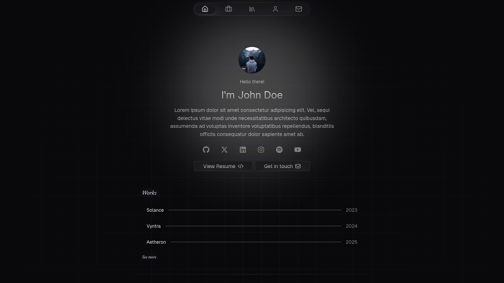
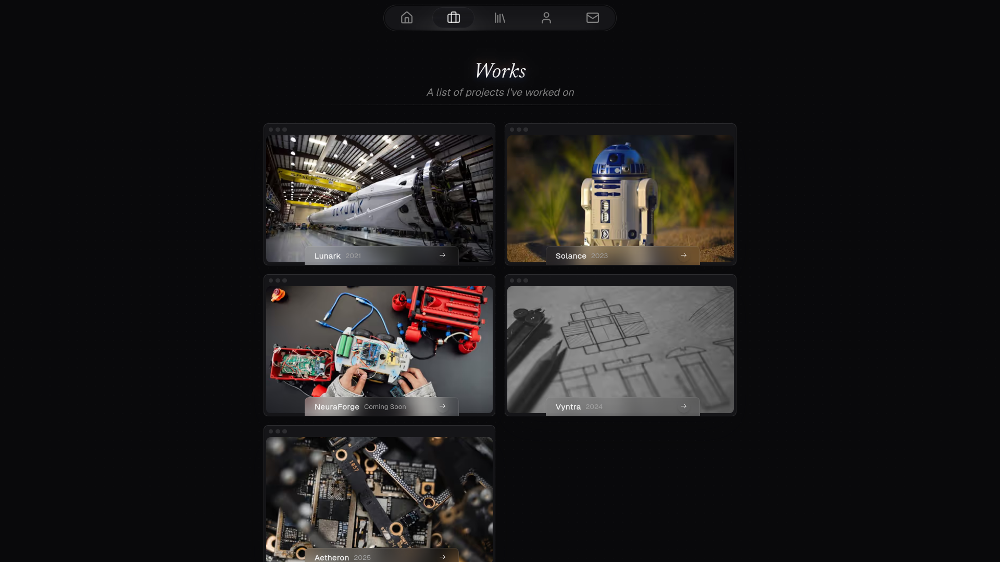
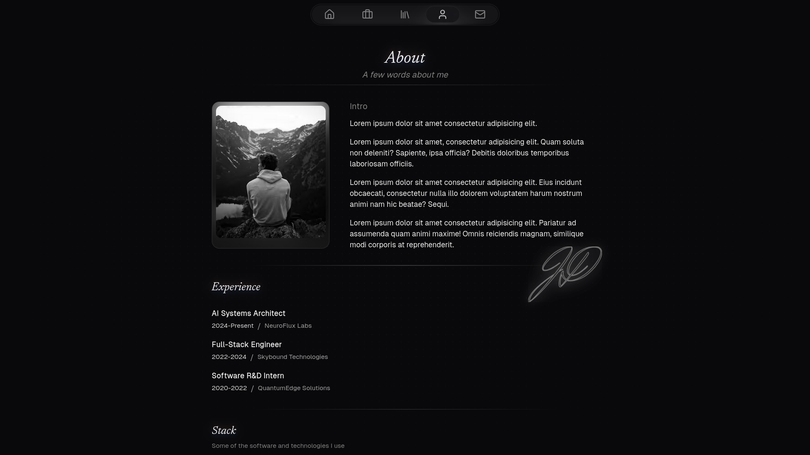
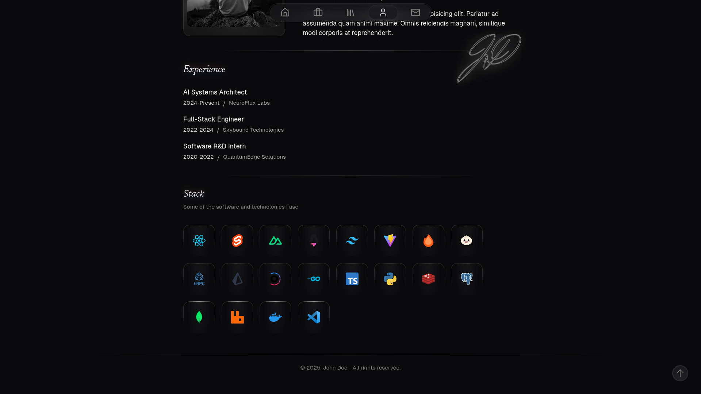
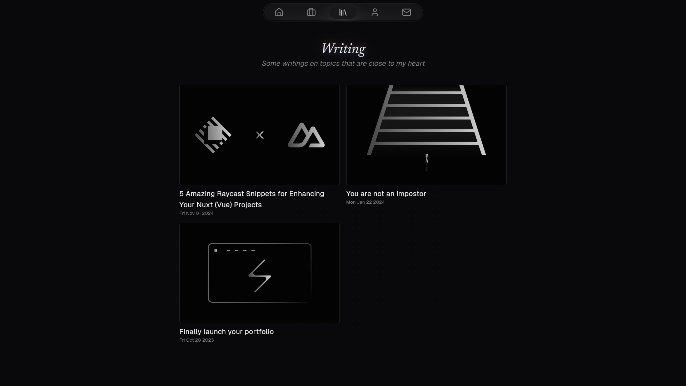
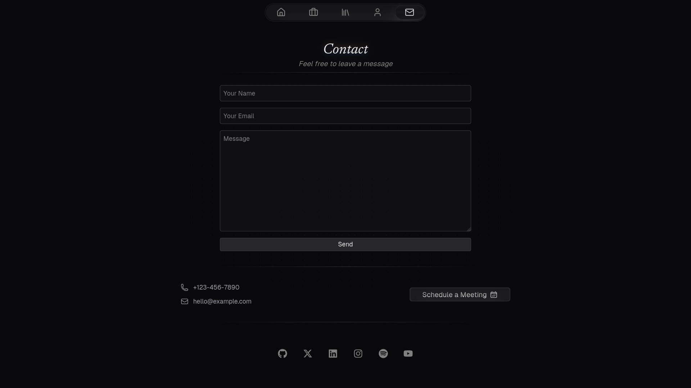

# Astro Canvas

Astro Canvas is a beautiful, blazingly fast portfolio website template built with [Astro](https://astro.build) and [Svelte](https://svelte.dev) components.

<p>
  <a href="https://deploy.workers.cloudflare.com/?url=https%3A%2F%2Fgithub.com%2Fkrishna-santosh%2Fastro-canvas" style="margin-right: 8px;">
    
  </a>
  <a href="https://vercel.com/new/clone?repository-url=https%3A%2F%2Fgithub.com%2Fkrishna-santosh%2Fastro-canvas&project-name=astro-canvas&repository-name=astro-canvas">
    
  </a>
</p>

---

## Demo

You can see a live demo at [canvas.krish.fyi](https://canvas.krish.fyi)

## Preview

|                                                                      |                                                                      |
| :------------------------------------------------------------------: | :------------------------------------------------------------------: |
|      Home      |     Works     |
|     About    |   Skills   |
|  Writing |  Contact |
|                                                                      |                                                                      |

## Quick Setup

1. Clone this repository locally

   ```bash
   git clone https://github.com/krishna-santosh/astro-canvas.git
   ```

> This project uses bun as package manager, feel free to use your preferred one

2. Install dependencies

   ```bash
   bun install
   ```

3. Start development server

   ```bash
   bun dev
   ```

4. Build the project

   ```bash
   bun run build
   ```

5. Preview the build output

   ```bash
   bun preview
   ```

## Deployment

Since this is a completely static build, you can use any hosting provider that supports hosting a static site, like Github Pages, Cloudflare Pages, Cloudflare Workers (Static Assets), Vercel e.t.c

You can also use Nginx or Caddy optionally with docker to host this website :)

## How to Modify the Portfolio Content

- All editable content - writing, projects, and tech stack can be updated in the `src/data` directory, following the schema defined in `src/content.config.ts`

- All images (for your writings, projects, and profile picture) are stored in src/assets.
  Replace them as needed and update their paths wherever they’re referenced.

- Update FAQs in `src/components/FAQ.svelte`.

- Update your Cal.com meeting link in `src/components/MeetingButton.astro`

- Update the signature SVG in `src/components/Signature.astro`

  > Don’t have one? You can generate it using [text-to-svg](https://text-to-svg.com)

  > After generating your SVG, copy it into Signature.astro, add the class **signature** to both the `<svg>` and its `<path>`, and include class:list={[className]} on the `<svg> `element.

- Update the `site` property in `astro.config.mjs` to your deployment URL

- Finally, clone the repo and run it locally to personalize anything else, like your name, bio, resume, social links, and site metadata (title, description, etc.).

- You can safely delete the `preview` directory at the project root which contains preview screenshots

## Setup Contact Form

This portfolio template comes pre-configured with [Congram](https://congram.velopulent.com) to handle contact form submissions

W.I.P

## Stats

- This project aims to be a near-perfect replica of the original Canvas Template by Hugo Richard, rebuilt in Astro with a few personal tweaks and improvements.

- This is a fully static site, no server-side processing or database required.

- i18n support isn’t included.

- Interactivity is handled through Svelte islands.

With that out of the way, here are some numbers:

### This rewrite in Astro aims to be faster, smaller and lighter

✨ Build times dropped from **80 seconds** to just **6 seconds**, that’s about 13x speedup!

✨ Initial Home Page request size dropped from **710kb** to **139kb**!

✨ JS on Initial Page load dropped from **343kb** to **35kb**!

✨ The overall build size is now much smaller, meaning faster downloads and quicker page loads.

✨ Thanks to Svelte, there’s **zero runtime overhead**.

> Tested on machine with Ryzen 7 3700X, 2666MT/s DDR4 RAM

## Credits

A huge thanks to [Hugo Richard](https://github.com/HugoRCD), the original creator of the [Canvas Nuxt Template](https://github.com/HugoRCD/canvas).

This project wouldn’t exist without his exceptional design and thoughtful structure.

This Astro version is a rebuilt and optimized adaptation, made with deep respect for the original work, focused on performance, maintainability, and a smoother developer experience.
